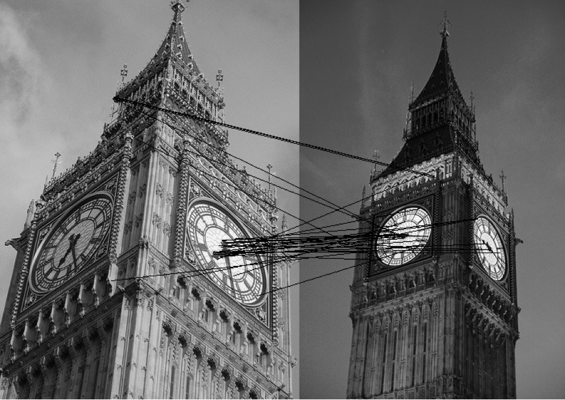
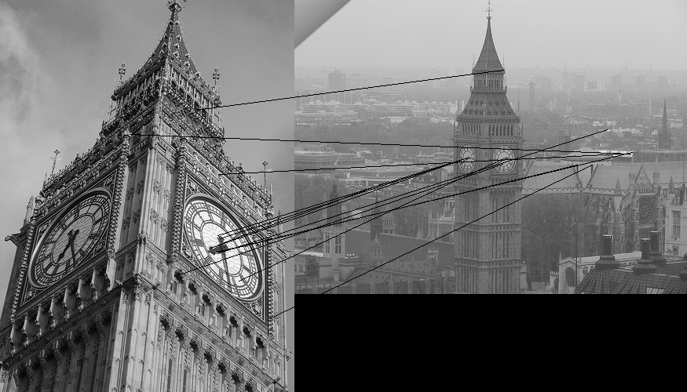
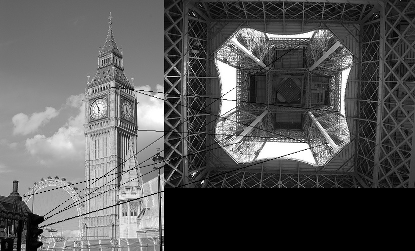
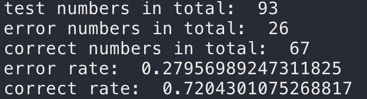
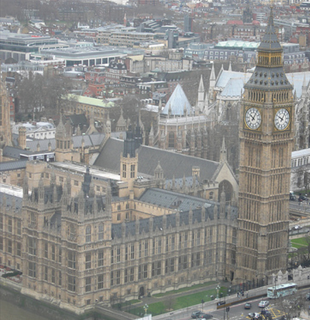
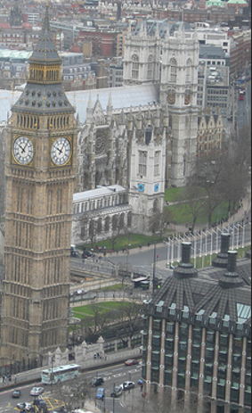
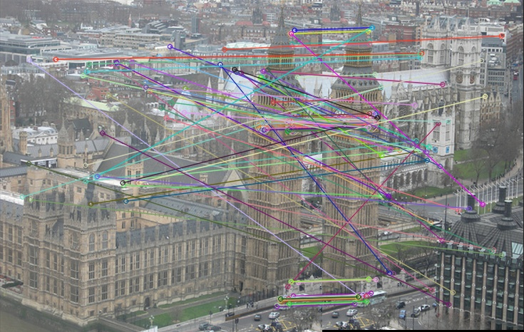
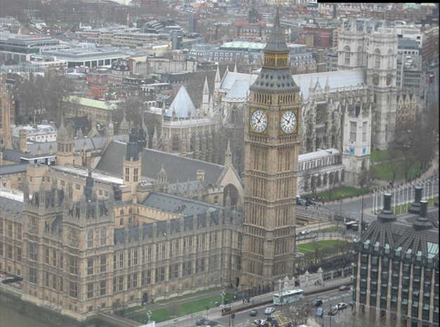

# A2

### Description:

 This is our assignment2. There are three main functions included: 

1. image feature points indexing, matching (use ORB) and image clustering. 
2. images transformations. 
3. Automatic image matching and transformations

### How to run code:

`chmod u+x ./a2`

 `./a2 part1|part2|part3 [parameters] ` (assignment pdf's running commands can be directly applied )  

 Solid examples:  
 `./a2 part1 10 part1-images/*.jpg outputfile.txt`  

 `./a2 part2 4 part2-images/book1.jpg part2-images/book2.jpg  book_output.jpg 318,256 141,131 534,372 480,159 316,670 493,630 73,473 64,601`  

 `./a2 part3 part3-testcase/1.jpg part3-testcase/2.jpg part3_output.jpg`  

### Assumption made:

For part1, we  assume that clustering images are somewhat similar, and they should be 'natural photos' (should not rorate too much).

For part3, we assume that two input images be very similar. They can be took by two cameras, but there should not have rapid changes (like: someone appears in one image while disappear in the other image).

 

## Part1

### Approach:

We use methods mainly as the assignment pdf wrote, include: extract ORB features using opencv; use normalized distance to measure the 'distance' between two feature points; use sklearn->SpectralClustering to cluster feature similatiry. We use brute-force iteration to measure each two images' pair's similarity. For 'normalized distance', we use the method as this course's module 6's slide shows: calculate the normalized/relative distance using f1 f2 f2_2, where f2 is the nearest feature point and f2_2 is the second nearest feature point.

### Running result:

During the test, by running the error-test.py program several times, it shows that the overall correct rate is around 70%. However, the correct rate is flatuated. 

### Other (ever tried, but failed) methods:

1. Use a mixture score of both feature similarity and 'image pHash hamming distance' to measure the similarity better.  Result: failed, because we found that pHash's hamming distance is very close to ORB feature similarity's results, so it is no helpful to our program's accuracy.
2. Use k-means' variant algorithms (like k-means++) to solve the problem. Result: failed, because they have lower accuracy after running the program.
3. Use 'colour histogram' technique to help improve clustering accuracy. Result: failed, because just like 'phash score', they have a very similar distribution to ORB feature's similarity matrix.

### Further improvement:

We didn't know that we are allowed to use opencv.BFMatcher() to solve the problem, so we implement brute-force comparison program by our own. It is rather slow than BFMatcher's KNN algorithm, but it has a similar accuracy. (we wrote a simple program using BFMatcher and the result is similar). Also, we use cv2.line() to draw lines between feature points, so the line is black and there's no colorful pixel marks.

 

## Part2

### Goal:

Basically two functions need to be implemented, including projective transformation of image  
and calculating transformation matrix based on given matched points .

### Approach/implementation: 
(1) projective transformation: function "proj_transform(img_in, mat)" is defined to serve this purpose,  
where img_in is the input image, and mat is the given transformation matrix. First, the inverse matrix  
of the original transformation matrix is calculated so that inverse warping can be applied. Then, create  
a blank 2d array storing the output data and loop over each pixel for reverse warping. At each pixel,  
homogeneous coordinate of the pixel is constructed and then multiplied by the inverse transformation  
matrix for warping back to the coordinate in the original image. Divided by the w, 2d coordinate can be  
then acquired as well. If the corresponding pixel lie within the extent of original image, the pixel  
value in output image would be resampled from the original image. Otherwise, would be filled with 0.  
The function will return the image object at the end.  
(2) retrieve transformation matrix: function "get_trans_matrix(n, dst_xy, src_xy)" is defined to serve  
this purpose, where n is the number of matched points, dst_xy and src_xy are the coordinates of those  
matched points in image1 and image2, respectively. The general solution to retrieving the transformation  
matrix follows the equation in page 53 of the lecture09 slides. So, when there are four points,  
8*8 coefficients matrix of the equation is formed using coordinates of matched points. And then, the  
parameters ranging from h11 to h32 can be acquired by solving the equation. h33 is added at the end   
to form the transformation matrix.  

### Problems/Assumptions:  
(1) One major problem I faced or struggled with is the coordinate system. Originally, the xy-coordinate  
system is used across the theory, and I tried to follow this pattern by putting the origin point at  
either the top-left or the bottom-left corner of the pixel. However, I cannot get correct result of  
transformation using the Lincoln.jpg image, even though I can get correct results of all other forms  
of transformation. Later on, with the help of suggestions of other students in the discussion, I found  
that this is probably due to the flipping of y-axis. So, after redefining the direction of coordinate  
system by following that of the image columns and rows, problem solved.  
(2) For the calculation of transformation matrix, the solution is discussed as above for n=4. For n=1,  
the tx, ty can be easily calculated by the offset between coordinates. Unfortunately, we are not able to  
form the correct coefficient matrix at the moment and thus the program cannot deal with n=2 and n=3. 

### Extra work: 
Notice that the examples of all output image after warping do not include the entire extent of the full  
transformed image. We also tried to solve this issue by calculating the bounding box of the output first  
so that the entire scence can be retained after warping. See the part2_test.py file for implementation.  
And some corresponding output can be found in the repo as well for comparison.

## Task 3:

Approach:

In task 3, we try to stitch two images into one image. First, we extract interest points from both images. Second, we implement RANSAC provided by OpenCV, to draw the relative transformation between two images. After we extract good interest points and corresponding transformation relationships between each pairs of interest points, we set up the background needed for the two images to stitch. The final step is to stitch two images together, and finally we produce the output image of the stitched image. The interface of stitching two images are provided in the main function. 

Problems encountered:

In order to test the approach of task 3, we first cut one image into two pieces, with partially overlapping. For example, in the sample provided in our repository, we cut the image ‘bigben_2.jpg’ into two separate images, one is the left part of ‘bigben_2.jpg’ named ‘bigben_2_left.jpg’, one is the right part of ‘bigben_2.jpg’ named ‘bigben_2_right.jpg’, with overlapping. The result shows that our approach can obtain nearly the same result of the original ‘bigben_2.jpg’. However, there are different ways of cutting images into two pieces, or even more pieces. For example, if we cut the image in random directions, for example, cut the image diagonally, we still face some problem of stitching images. We think this problem due to the lack of translation in our approach. Our approach can work good on the given directions of cutting images, but once encountering unknown directions of cutting image, our approach still need to be amended.

Test result:

The given images are the test result of our approach for task 3. In order to test the error rate of our approach, we used a sample image called ‘bigben_2.jpg’. We used an image cutter application to cut this image into two images, ‘bigben_2_left.jpg’ and ‘bigben_2_right.jpg’. After running our program, the images shows the result of stitching these two images. 

  

One more step, we tried to use two independent images to test our program. However, the result is not as good as the test shows above. We think this was caused by the accuracy of our approach used in task 3, because we did not directly used the approach method which we used in task 1 and task 2. Also, the location and the angle of the camera can also have huge impact on stitching images. Even for the same object, due to the limitation of the error rate of the algorithm, can also cause troubles for stitching images together. We will continue amending the details of our approach to improve the accuracy of the implementation.

 

 ## Contributes     
 
 Part1: Jiayi Kong   
 Part2: Duozhao Wang  
 Part3: Duozhao Wang   